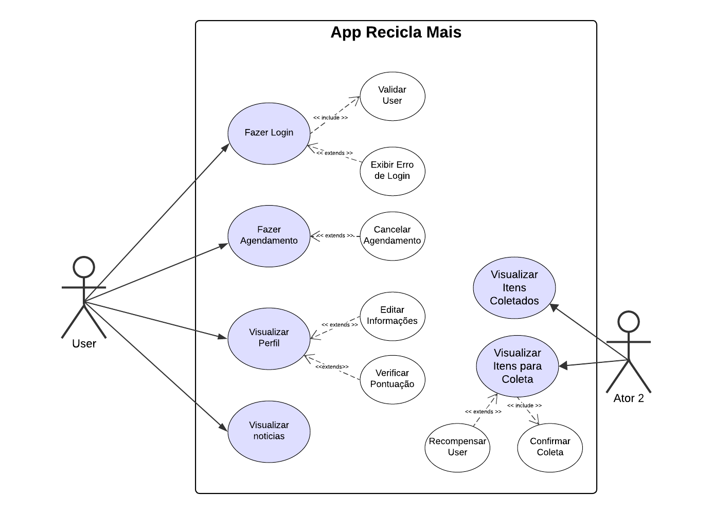

# Especificações do Projeto

A definição exata do problema e os pontos mais relevantes a serem tratados neste projeto foram consolidadas com a participação dos usuários em um trabalho de imersão feito pelos membros da equipe a partir da observação dos usuários em seu local natural e por meio de entrevistas. Os detalhes levantados nesse processo foram consolidados na forma de personas e histórias de usuários.

## Personas

As personas levantadas durante o processo de entendimento do problema são apresentadas nas Figuras que se seguem:

## Histórias de Usuários

A partir da compreensão do dia a dia das personas identificadas para o projeto, foram registradas as seguintes histórias de usuários.

## Requisitos

As tabelas que se seguem apresentam os requisitos funcionais e não funcionais que detalham o escopo do projeto. Para determinar a prioridade de requisitos, aplicar uma técnica de priorização de requisitos e detalhar como a técnica foi aplicada.

### Requisitos Funcionais

|    ID    | Descrição do Requisito  | Prioridade |
|------|-----------------------------------------|----|
|RF-001| O sistema deve permitir o cadastro de usuário. (Todos os Usuários) | Alta 
|RF-002| O sistema deve fornecer recomendações de pontos de coleta de lixo eletrônico.(João Oliveira)| Média | 
|RF-003| O sistema deve permitir o agendamento de coleta de lixo eletrônico.(João Oliveira)  | Alta |
|RF-004| O sistema deve permitir o cadastro de materiais que serão doados por meio do agendamento de coleta.(João Oliveira) | Alta |
|RF-005| O sistema deve emitir um aviso informando que o agendamento foi realizado com sucesso.(João Oliveira) | Baixa |
|RF-006| O sistema deve enviar email/mensagem no whatsapp com a confirmação e os detalhes do agendamento.(João Oliveira) | Baixa |
|RF-007| O sistema deve ter um portal de noticias para informação dos usuários.(Ana Silveira) | Alta |
|RF-008| O sistema deve permitir a doação de equipamentos com funcionamento considerado normal.(Ana Silveira) | Alta |
|RF-009| O sistema deve exibir o histórico de doações e/ou descartes feitos pelo usuário.(Ana Silveira) | Alta |
|RF-010| O sistema deve exibir estatísticas das doações efetuadas nos meses anteriores, mês atual, nos anos anteriores e o acumulado do ano atual.(Ana Silveira) | Média |
|RF-011| O sistema deve permitir o cadastro de empresas para realizar ou receber doações.(Leonardo Soares) | Alta |
|RF-012| O sistema deve permitir que o usuário crie um aviso de intenção dereceber doações.(Carlos Nogueira) | Alta |
|RF-013| O sistema deve permitir o cadastro de empresas parceiras que terão pontos de coleta de pilhas e baterias.(Amanda Alves) | Alta |
|RF-014| O sistema deve permitir a visualização de todas as empresas parceiras que tem pontos de coleta de pilhas e baterias.(João Oliveira) | Alta |
|RF-015| O sistema deve exibir para o usuário as datas e horários disponíveis para fazer doações e/ou coletas de lixo eletrônico.(João Oliveira) | Alta |
|RF-016| O sistema deve exibir permitir a visualização do perfil de usuário.(Todos os usuários) | Alta |

### Requisitos não Funcionais

|ID     | Descrição do Requisito  |Prioridade |
|-------|-------------------------|----|
|RNF-001| O sistema deve atender aos requisitos básicos de acessibilidade do Guia WCAG, nível A. | Média | 
|RNF-002| O sistema deve ser responsivo e permitir o acesso via celulares e tablets. | Média | 
|RNF-003| O sistema deve processar requisições do usuário em no máximo 3s |  BAIXA |
|RNF-004| O sistema deve estar disponível 24 horas por dia, 7 dias por semana |  Média |
|RNF-005| O sistema deve ser compatível com navegadores Google Chrome, Firefox, Microsoft Edge. |  Alta |
|RNF-006| O sistema deve ser compatível com navegadores Google Chrome, Firefox, Microsoft Edge. |  Alta |

Com base nas Histórias de Usuário, enumere os requisitos da sua solução. Classifique esses requisitos em dois grupos:

- [Requisitos Funcionais
 (RF)](https://pt.wikipedia.org/wiki/Requisito_funcional):
 correspondem a uma funcionalidade que deve estar presente na
  plataforma (ex: cadastro de usuário).
- [Requisitos Não Funcionais
  (RNF)](https://pt.wikipedia.org/wiki/Requisito_n%C3%A3o_funcional):
  correspondem a uma característica técnica, seja de usabilidade,
  desempenho, confiabilidade, segurança ou outro (ex: suporte a
  dispositivos iOS e Android).
Lembre-se que cada requisito deve corresponder à uma e somente uma
característica alvo da sua solução. Além disso, certifique-se de que
todos os aspectos capturados nas Histórias de Usuário foram cobertos.

## Restrições

As questões que limitam a execução desse projeto e que se configuram como obrigações claras para o desenvolvimento do projeto em questão são apresentadas na tabela a seguir.

|ID| Restrição                                             |
|--|-------------------------------------------------------|
|01| A aplicação  deve atender às eventuais normas e leis municipais que se apliquem ao projeto           |
|02| A aplicação deve atender às especificações estabelecidas no contrato com a prefeitura                |
|03| A aplicação deve ser construida utilizando as principais tecnologias utilizadas na Web               |
|04| A equipe não deve subcontratar o desenvolvimento do trabalho                                         |

> **Links Úteis**:
> - [O que são Requisitos Funcionais e Requisitos Não Funcionais?](https://codificar.com.br/requisitos-funcionais-nao-funcionais/)
> - [O que são requisitos funcionais e requisitos não funcionais?](https://analisederequisitos.com.br/requisitos-funcionais-e-requisitos-nao-funcionais-o-que-sao/)

## Diagrama de Casos de Uso

 **Links Úteis**:
> - [Criando Casos de Uso](https://www.ibm.com/docs/pt-br/elm/6.0?topic=requirements-creating-use-cases)
> - [Como Criar Diagrama de Caso de Uso: Tutorial Passo a Passo](https://gitmind.com/pt/fazer-diagrama-de-caso-uso.html/)
> - [Lucidchart](https://www.lucidchart.com/)
> - [Astah](https://astah.net/)
> - [Diagrams](https://app.diagrams.net/)
