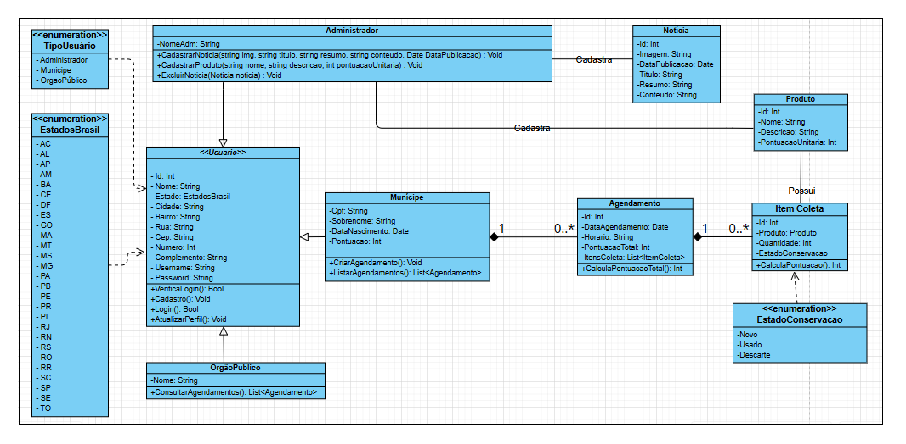

# Arquitetura da Solução

Pré-requisitos: <a href="04-Projeto de Interface.md"> Projeto de Interface</a>

A seguir, estão descritos os componentes e o ambiente de hospedagem da aplicação ReciclaMais. Este projeto busca oferecer uma plataforma de conexão para descarte sustentável de resíduos eletrônicos, integrando cidadãos e serviços de coleta.

## Diagrama de Classes

Este diagrama de classes representa o sistema de agendamentos e coleta de produtos eletrônicos, voltado para diferentes tipos de usuários, incluindo administradores, municípes e órgãos públicos. O sistema permite o gerenciamento de produtos, agendamentos e notícias, com funcionalidades específicas para cada tipo de usuário.

<figure>
  
  <figcaption style="text-align: center;">Diagrama de Classes - Versão 2</figcaption>
</figure>

### Classes e Atributos
#### Administrador

A classe Administrador representa um usuário com privilégios de administração no sistema. O administrador possui atributos como NomeAdm e métodos para gerenciar notícias e produtos.
- Métodos:
1. CadastrarNoticia: Permite o cadastro de uma notícia com imagem, título, resumo, conteúdo, e data de publicação.
2. CadastrarProduto: Permite o cadastro de novos produtos com informações como nome, descrição e pontuação unitária.
3. ExcluirNoticia: Permite a exclusão de uma notícia específica.

#### Noticia

A classe Noticia representa as notícias cadastradas no sistema. Ela contém atributos como Id, Imagem, DataPublicacao, Titulo, Resumo, e Conteudo. As notícias podem ser gerenciadas pelo administrador e exibidas aos usuários do sistema.

#### Produto

A classe Produto define os produtos disponíveis para coleta no sistema. Os atributos incluem Id, Nome, Descricao e PontuacaoUnitaria, que indica a pontuação atribuída por unidade do produto. Os produtos cadastrados são utilizados nos agendamentos e compõem os itens de coleta.

#### ItemColeta

A classe ItemColeta representa um item específico que será coletado durante um agendamento. Cada ItemColeta está associado a um Produto e inclui atributos como Quantidade e EstadoConservacao.
O atributo EstadoConservacao é do tipo EstadoConservacao, um enumerado que indica o estado de conservação do item (Novo, Usado, ou Descarte).
- Método:
1. CalcularPontuacao: Calcula a pontuação do item multiplicando a pontuação unitária do produto pela quantidade especificada.

#### Agendamento

A classe Agendamento representa um agendamento de coleta de produtos. Ela contém atributos como Id, DataAgendamento, Horario, PontuacaoTotal, e uma lista de ItemColeta.
- Método:
1. CalcularPontuacaoTotal: Calcula a pontuação total do agendamento somando a pontuação de cada item de coleta.

#### Usuario

A classe Usuario é uma classe base para diferentes tipos de usuários no sistema. Ela inclui atributos como Id, Nome, Estado, Cidade, Bairro, Rua, Cep, Numero, Complemento, Username, e Password.
- Métodos:
1. VerificarLogin: Verifica as credenciais de login do usuário.
2. Cadastro: Permite o cadastro de um novo usuário.
3. Login: Realiza o login do usuário no sistema.
4. AtualizarPerfil: Permite que o usuário atualize seu perfil.

#### Municipe

A classe Municipe é uma especialização de Usuario e representa um usuário que pode fazer agendamentos de coleta. Ela contém atributos específicos como Cpf, Sobrenome, DataNascimento, e Pontuacao.
- Métodos:
1. CriarAgendamento: Permite que o município crie um novo agendamento de coleta.
2. ListarAgendamentos: Retorna uma lista de agendamentos feitos pelo município.

#### OrgaoPublico

A classe OrgaoPublico é outra especialização de Usuario, representando um órgão público que pode consultar agendamentos de coleta.
- Atributo:
Nome: Nome do órgão público.
- Método:
1. ConsultarAgendamentos: Permite que o órgão público consulte todos os agendamentos do sistema.

### Enumerações
#### TipoUsuario

Enumeração que define os tipos de usuários que podem acessar o sistema: Administrador, Municipio, e OrgaoPublico.

#### EstadosBrasil

Enumeração que define os estados do Brasil, utilizados no atributo Estado da classe Usuario.

#### EstadoConservacao

Enumeração que define o estado de conservação de um item de coleta: Novo, Usado, e Descarte.

### Relacionamentos entre Classes
- Herança: A classe Usuario é a classe base para Municipe e OrgaoPublico, representando a relação "é-um" (ou especialização) entre usuários do sistema.

- Agendamento e ItemColeta: A classe Agendamento possui uma associação de 1 para * com ItemColeta, indicando que um agendamento pode conter vários itens de coleta.

- ItemColeta e Produto: Cada ItemColeta está associado a um Produto, permitindo acesso direto às informações de pontuação do produto.

- Administrador, Noticia, e Produto: A classe Administrador tem métodos para gerenciar Noticia e Produto, indicando que o administrador é responsável por manter esses registros no sistema.

## Modelo ER

> - [Como fazer um diagrama entidade relacionamento | Lucidchart](https://www.lucidchart.com/pages/pt/como-fazer-um-diagrama-entidade-relacionamento)

## Esquema Relacional

> - [Criando um modelo relacional - Documentação da IBM](https://www.ibm.com/docs/pt-br/cognos-analytics/10.2.2?topic=designer-creating-relational-model)

## Modelo Físico (DDL)

Entregar um arquivo banco.sql contendo os scripts de criação das tabelas do banco de dados. Este arquivo deverá ser incluído dentro da pasta src\bd.

## Instruções SQL de Manipulação do BD (DML)

Entregar um arquivo dml.sql contendo os scripts de manipulação de banco de dados. Este arquivo deverá ser incluído dentro da pasta src\bd.

## Tecnologias Utilizadas

Descreva aqui qual(is) tecnologias você vai usar para resolver o seu problema, ou seja, implementar a sua solução. Liste todas as tecnologias envolvidas, linguagens a serem utilizadas, serviços web, frameworks, bibliotecas, IDEs de desenvolvimento, e ferramentas.

Apresente também uma figura explicando como as tecnologias estão relacionadas ou como uma interação do usuário com o sistema vai ser conduzida, por onde ela passa até retornar uma resposta ao usuário.

## Hospedagem

Explique como a hospedagem e o lançamento da plataforma foi feita.

> **Links Úteis**:
>
> - [Website com GitHub Pages](https://pages.github.com/)
> - [Programação colaborativa com Repl.it](https://repl.it/)
> - [Getting Started with Heroku](https://devcenter.heroku.com/start)
> - [Publicando Seu Site No Heroku](http://pythonclub.com.br/publicando-seu-hello-world-no-heroku.html)
