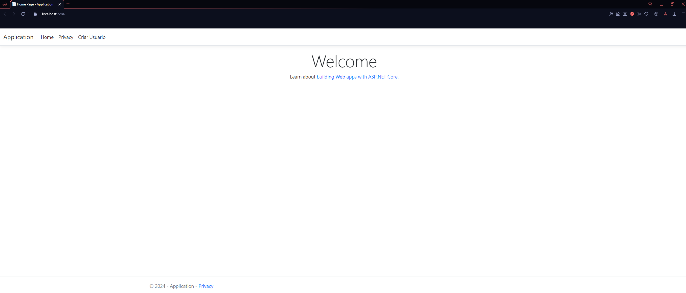
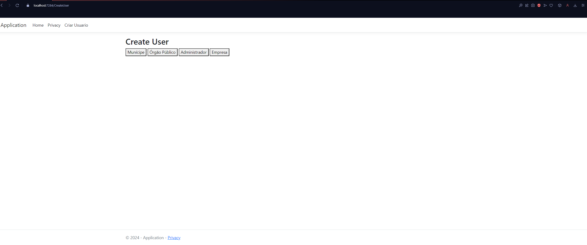
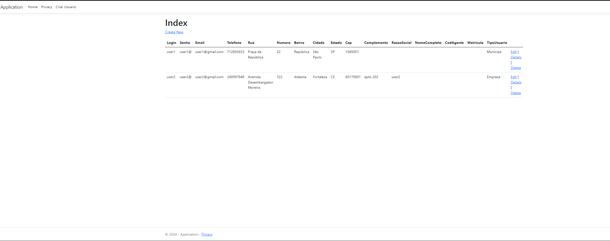
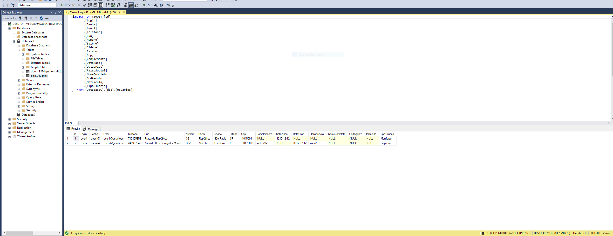
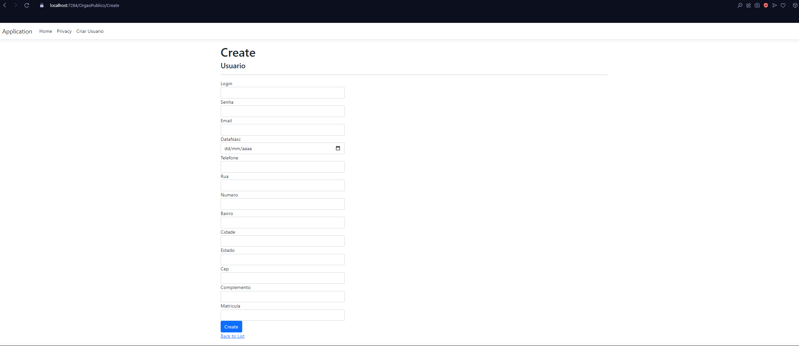
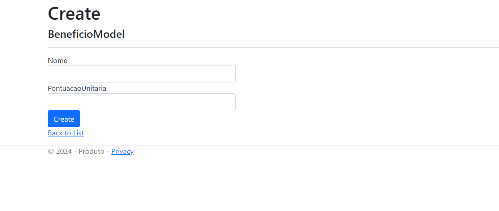
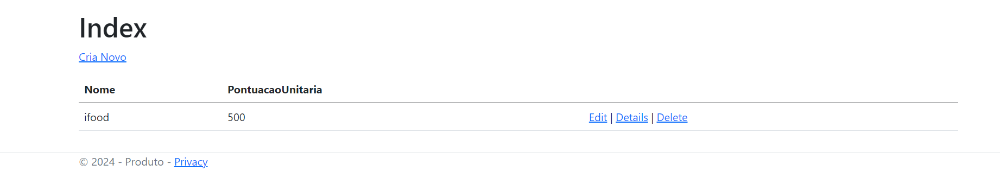
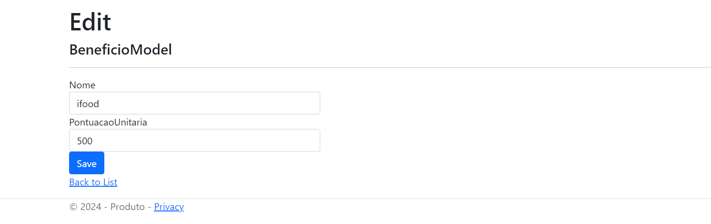
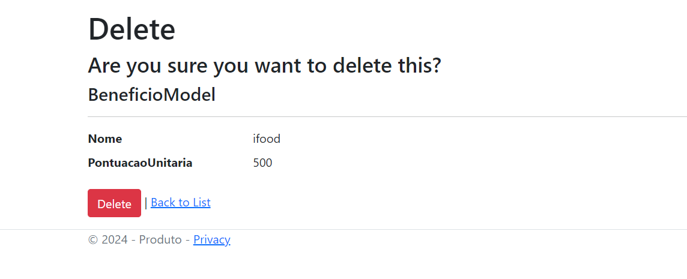

# Programação de Funcionalidades

## Funcionalidade: Tela "Notícias sobre Lixos Eletrônicos"

### Responsável: Andressa Dias Marin

Foi iniciado o estudo do microfundamento de Desenvolvimento Web de Back-end. Reproduzi todos os exemplos abordados pelo professor Kleber em todas as aulas do microfundamento. Iniciei a criação e estruturação da minha tela Notícias, conforme imagens que seguem abaixo.

Na tela abaixo, o usuário deve fazer login para ter acesso aos dados.

Após login, apenas o administrador terá acesso à todos os campos.

Criar

Editar

Visualizar

Deletar

Na tela abaixo é possível conferir a criptografia das senhas.

Na tela abaixo, o usuário André não tem acesso à "Usuários", que ficou restrito aos administradores.

Registro de "usuário e/ou senha inválidos".

#
## Funcionalidade: Tela "Autenticação de Usuários"
### Responsável: Marco Antonio de Oliveira Costa Júnior

Foi iniciado o estudo do MF de desenvolvimento de back-end. Reproduzi todos os exemplos abordados pelo professor KLEBER JACQUES até a sessão de estudo: UNIDADE 2 - Tema 1 - Controle de Usuários. Iniciei a criação e a estruturação da minha tela, conforme as imagens que seguem abaixo.

=======
### Tela Inicial do CRUD

>>>>>>> 38466cc8bd28c147734d67a49c25d6cc750fd376

=======
### Criação de Tipo de Usuário

>>>>>>> 38466cc8bd28c147734d67a49c25d6cc750fd376

=======
### Visualização de Usuários Criados na Aplicação

>>>>>>> 38466cc8bd28c147734d67a49c25d6cc750fd376

### Visualização de Usuários Criados no BD

### FORM de Criação

<<<<<<< HEAD
## Funcionalidade: Tela "Beneficio"

## Responsavel: Isabele Maria Da Silva 

Foi iniciado algumas aulas do microfundamento de desenvolvimento web Beck-end. E algumas aulas na plataforma do youtube. Aonde foi abordado o conteúdo ASPNET MVC, Criando minha TELA BENEFICIO

--Criar

--Ler

--Editar

<<<<<<< HEAD
--Delete

<<<<<<< HEAD

=======

>>>>>>> 38466cc8bd28c147734d67a49c25d6cc750fd376

